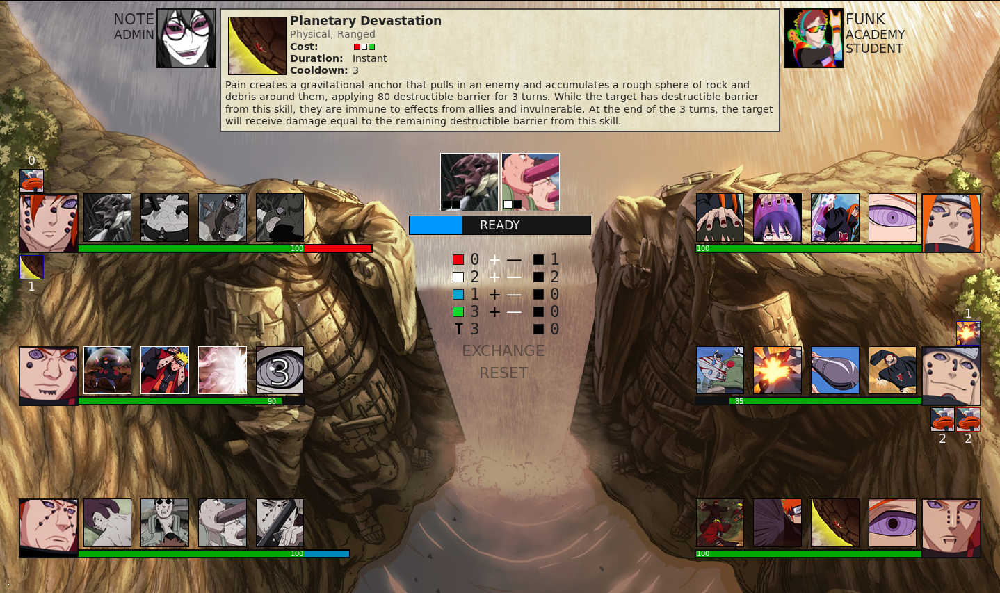

# Naruto Unison

The next generation of Naruto Arena, built from the ground up in Haskell and Elm.

*Naruto* was created by Masashi Kishimoto, published by Pierrot Co., and licensed by Viz Media.

Currently pre-alpha and in active development. Nothing is guaranteed to be stable or fully functional.

- [Installing](#installing)
- [Running](#running)
  - [Development](#development)
  - [Production](#production)
- [Model Syncing](#model-syncing)
- [Haskell: How and Why](#haskell-how-and-why)
  - [How](#how)
  - [Why](#why)





## Installing

1. Install [Git](https://git-scm.com/downloads), [Stack](https://docs.haskellstack.org/en/stable/install_and_upgrade/), [PostgreSQL](https://www.postgresql.org/download/), and [NPM](https://www.npmjs.com/get-npm). Make sure all executables are added to your path.

2. Run `stack install yesod-bin`.

2. In the [elm](elm/) folder of the project, run `npm install`.

3. In the root directory of the project, run `stack build`.

4. Start up the PostgreSQL server.

5. Create a new database and add it to the PostgreSQL [pg_hba.conf](https://www.postgresql.org/docs/9.1/auth-pg-hba-conf.html) file.

6. Configure environment variables in [config/settings.yml](config/settings.yml) to point to the database.

## Running

### Development

To use a development web server, run `stack exec -- yesod devel` in the root directory of the project. Recompile the Elm frontend with `(cd elm && npm install)` whenever changes are made to the [elm](elm/) folder.

### Production

In order to run the server in production mode, which has significantly better performance, deploy it with [Keter](https://www.yesodweb.com/blog/2012/05/keter-app-deployment). It is recommended to use a standalone server for hosting the Keter bundle and PostgreSQL database. The only server requirement to host Keter bundles is the Keter binary itself, which may be compiled on another machine with GHC and copied over. Docker support is planned but not yet implemented.

### Tests

The test suite can be run with `stack test`, or `stack test --test-arguments=--format=failed-examples` to hide successes.

## Model Syncing

After making changes that affect the JSON representation of a data structure transmitted to the client, run `stack run elm-bridge` to make the corresponding changes to the client's representations. Always run `(cd elm && npm install)` after altering code in the [elm](elm/) folder.

## Haskell: How and Why

This postscript was added because several of the people interacting with this project mentioned that they hadn't worked with Haskell before.

### How

#### IDEs

The recommended IDE is [Visual Studio Code](https://code.visualstudio.com/)  with the [Haskell Language Server](https://marketplace.visualstudio.com/items?itemName=alanz.vscode-hie-server) extension for [haskell-ide-engine](https://github.com/haskell/haskell-ide-engine). Alternatively, Emacs has [various Haskell plugins](https://wiki.haskell.org/Emacs).

#### Getting Started with Haskell

For newcomers, [Learn You a Haskell](http://learnyouahaskell.com/chapters) is an excellent introduction to the language.  With Stack downloaded (per above), `stack ghci` can be used whenever Learn You a Haskell says to use plain old `ghci`.

Readability is one of Haskell's key strengths, so browsing through sources of well-known libraries on [Hackage](https://hackage.haskell.org/packages/browse) is also a good way to learn how to write idiomatic, practical code. In particular, the [containers](https://hackage.haskell.org/package/containers) library is worthwhile reading material because it spans from low-level data-structure manipulation to high-level abstractions, and is well-documented and ubiquitous.

### Why

Although Haskell is an unusual language, its idiosyncracies make it the perfect fit for a project such as Naruto Unison.

#### Concurrency

Haskell is excellent at parallel computing. Naruto Unison is built on top of the [Yesod framework](https://www.yesodweb.com/), a fully asynchronous web server. With lightweight green threads and event-based system calls, every connection to the server runs smoothly in separate non-blocking processes, communicating via [transactional channels](http://hackage.haskell.org/package/stm-2.5.0.0/).

#### Separation of Pure and Impure Functions

Unless quarantined in specific monads, Haskell functions are referentially transparent, meaning they always produce the same output if given the same inputs and do not cause side-effects. This is ideal for a game in which the game engine is an independent, quasi-mathematical process that can (and should!) be separate from all the effectful work of HTTP handling and websockets and so on. Separating pure and impure functions makes the codebase much easier to test, prevents numerous bugs that could otherwise occur, and promotes healthy concurrency.

As an example, all the functions in [Model.Ninja](src/Model/Ninja.hs) are guaranteed to be pure. This one modifies a Ninja's health while constrained to a minimum and maximum:

```haskell
adjustHealth :: (Int -> Int) -> Ninja -> Ninja
adjustHealth f n = n { health = min 100 . max (Ninja.minHealth n) . f $ health n }
```

It is a simple transformation of data. Because `adjustHealth` is pure, `Ninja.minHealth` is also guaranteed to be pure. Their output is consistent and they can't modify shared state, perform network operations, or anything else that might cause problems in a multi-threaded environment.


#### Clear and Concise Math

Haskell's mathematical background lends itself to defining game calculations. For example, [Engine.Effects](src/Engine/Effects.hs) has functions like this one:

```haskell
snare :: Ninja -> Int
snare n = sum [x | Snare x <- Ninja.effects n]
```

This function does exactly what it looks like: sums up all effects with the `Snare Int`  constructor. Pattern matching inside list comprehensions is another distinguishing feature of Haskell. `Snare` happens to be a unary constructor; other constructors in the `Effect` sum type have multiple arguments, and they can be matched just as easily.

#### Monads

Another cool thing Haskell can do is define custom procedural contexts. Naruto Unison's `MonadPlay` monad typeclass is a purity-agnostic game-state transformation that provides the context of the current user and target. What that means in practice is that character implementations, even fairly complex ones, can be written very simply. For example, [Chiyo's Self-Sacrifice Reanimation](src/Characters/Shippuden/Family.hs) skill has the description, *"Chiyo prepares to use her forbidden healing technique on an ally. The next time their health reaches 0, their health is fully restored, they are cured of harmful effects, and Chiyo's health is reduced to 1."* This is its implementation:

```haskell
trap 0 OnRes do
    cureAll
    setHealth 100
    self $ setHealth 1
```

Haskell's brevity and readability in this regard are clear winners over other languages. There isn't any hidden complexity behind the scenes, either: `setHealth` is just a thin wrapper around `adjustHealth . const`, the function earlier in this README!

#### Most Importantly

[It's fun.](src/Core/Util.hs)

```haskell
type Lift mClass m = (MonadTrans (Tran m), mClass (Base m), m ~ Tran m (Base m))
type family Tran m :: (* -> *) -> * -> * where Tran (t n) = t
type family Base (m :: * -> *) :: * -> * where Base (t n) = n
```

This is a hobby project, after all.
